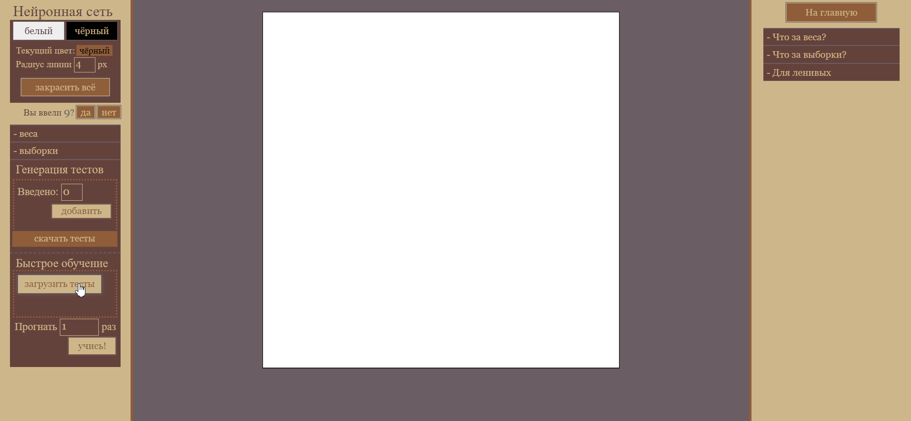
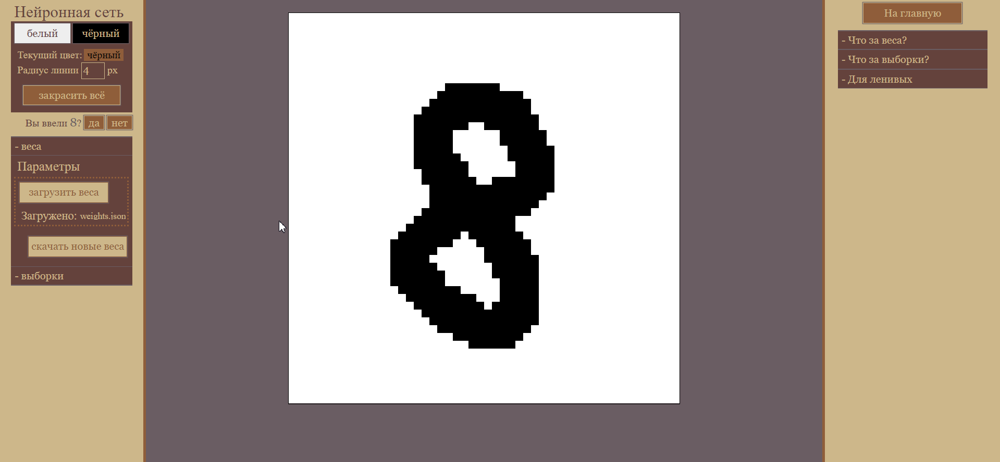

# Нейронная сеть для распознавания цифр
После обновления страницы все данные параметры обнуляются, поэтому их нужно скачивать и загружать. 

В целом, всё уже прописано на самой html-странице, здесь лишь информация по папке jsons. 

В этой папке два файла - `500 tests.json` - это тренировочные данные, составленные мной для обучения модели. Если есть желание, можно прогнать модель по ним. Для этого нужно на странице открыть вкладку выборки, и загрузить этот файл, используя кнопку `загрузить тесты`: 

Аналогично, во вкладку веса можно загрузить файл `weights.json` - результат обучения нейронки после нескольких её прогонов по тестам. 

Кнопка "на главную" существует, потому что эта страница - часть небольшого веб-приложения. Поскольку теперь я выделил её в отдельный репозиторий, эта кнопка никуда не ведёт